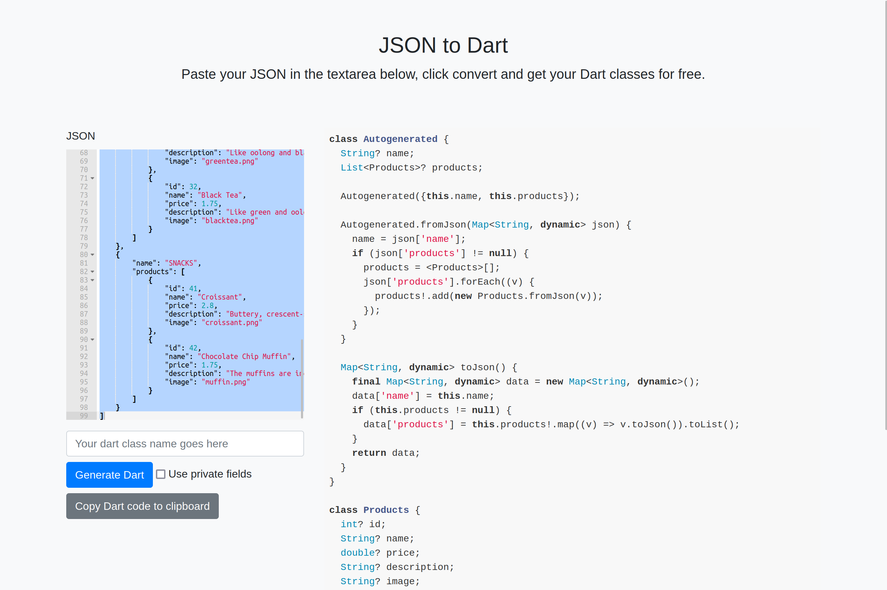

# Modelo de datos

## Descargar datos

Flutter nos da una solución para descargar datos, que es el paquete http, que nos permite hacer peticiones http.

Para usarlo, tenemos que añadirlo a nuestro pubspec.yaml.

```yaml
dependencies:
  http:
```

Y luego guardar.

Al momento de hacer la petición, tenemos que usar la asíncronia en dart. Que funciona de la siguiente manera:

```dart
Future<void> getData() async {
  final response = await http.get(Uri.parse('https://jsonplaceholder.typicode.com/users'));
  print(response.body);
}
```

Future en javascript es como una promesa, que se resuelve en un futuro.

## JSON

JSON es un formato de texto que se usa para intercambiar datos.

Dart no mapea automáticamente los valores JSON en clases, por lo que tenemos que hacerlo manualmente.

```dart
class User {
  final String name;
  final String email;
  final int age;

  User({this.name, this.email, this.age});

  factory User.fromJson(Map<String, dynamic> json) {
    return User(
      name: json['name'],
      email: json['email'],
      age: json['age'] as int,
    );
  }
}
```

Podemos utilizar algunos sitios para generar clases a partir de JSON, como por ejemplo [json2dart](https://javiercbk.github.io/json_to_dart/).


