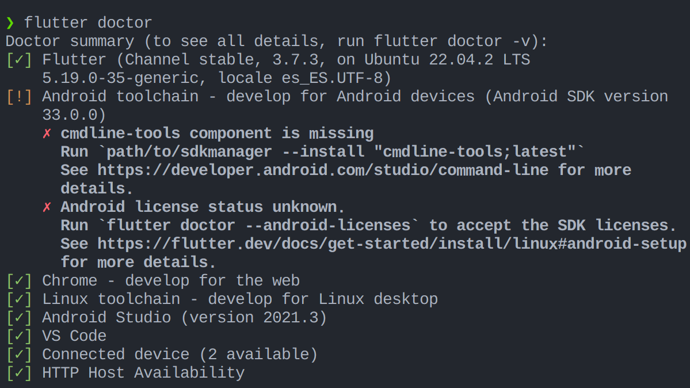
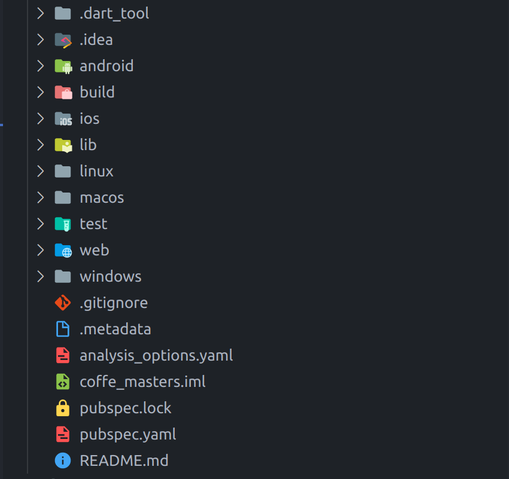

# Flutter

- Desarollado por Google. Open source (el código es abierto, cualquiera puede verlo y contribuir).

- Utiliza Dart como lenguaje de programación, también mantenido por Google y open source.

- Declarative UI framework (colección de herramientas), esto significa que no se necesita escribir código para crear la interfaz de usuario, sino que se describe la interfaz de usuario y Flutter se encarga de crearla.

- Componentes componibles. Así que en realidad podemos crear componentes cuyo nombre que vamos a usar aquí es widgets, así que vamos a componer widgets que podemos reutilizar en diferentes partes de nuestra aplicación.

- Dependency Rendering, por lo que en realidad, sus widgets tenemos dependencias en variables, propiedades, estados, que definirán cómo se representan sus widgets.

- Todo en la interfaz de usuario se expresa en widgets. Y un widget es solo una clase Dart, que extenderíamos desde una superclase de widget.

- El mismo código se puede ejecutar en mobile: Android y iOS, web. Desktop: Windows, Linux, Mac. Dispositivos embebidos: Fuchsia OS. Plataforma web. Por lo que **No es requerido reescribir el código para cada plataforma, un software un código**.

## Flutter vs React Native

Flutter está en el mismo grupo de React Native, Xamarin, etc. Pero Flutter es diferente a todos ellos.

- Lenguajes de programación: React Native utiliza JavaScript para el desarrollo de aplicaciones, mientras que Flutter utiliza Dart, un lenguaje de programación desarrollado por Google.

- Enfoque de renderizado: React Native utiliza un enfoque de renderizado basado en el Virtual DOM, mientras que Flutter utiliza un enfoque de renderizado basado en la composición de widgets y la API de Canvas.
  En React Native cuando creamos un botón en la interfaz de usuario, en realidad estamos creando un botón nativo, si creamos un botón en android estamos creando un botón nativo de android, si creamos un botón en iOS estamos creando un botón nativo de iOS...
  Renderiza en una vista nativa utilizando la plataforma subyacente (por ejemplo, UIView en iOS o View en Android).

  En Flutter no es asi, en Flutter renderizamos nuestro botón en un canvas, a un nivel muy bajo, que emula el estándar UI de cada plataforma. Entonces, en realidad, no estamos creando un botón nativo.

- Curva de aprendizaje: React Native puede ser más fácil de aprender para los desarrolladores que ya están familiarizados con JavaScript, mientras que Flutter puede requerir más tiempo de aprendizaje debido a su lenguaje de programación Dart y su enfoque de renderizado único.

- Rendimiento: Flutter puede tener un mejor rendimiento y una experiencia de usuario más suave en aplicaciones con gráficos intensivos, mientras que React Native puede ser más adecuado para aplicaciones con una interfaz de usuario más estática o basada en texto.

## Material | Cupertino

Flutter no utiliza ningún SDK, utiliza los widgets de la plataforma subyacente. Y tenemos dos widgets listos para usar, Material y Cupertino. Podemos resumir que Material es para Android y Cupertino es para iOS.

Podemos usar Cupertino para Android o la web, pero se veria raro. Lo usual es usar Material.

## Setup

### Cuentas de desarrollador

La cuenta de desarrollador nos permite publicar aplicaciones en las tiendas de aplicaciones de Android y iOS. Para publicar aplicaciones en la tienda de aplicaciones de Android, necesitamos una cuenta de desarrollador de Google Play. Para publicar aplicaciones en la tienda de aplicaciones de iOS, necesitamos una cuenta de desarrollador de Apple.

En el caso de que no queramos publicar aplicaciones en las tiendas de aplicaciones, no necesitamos una cuenta de desarrollador. Pero en caso contrario, es algo obligatorio.

Además, publicar una aplicación no es tan sencillo, pues requiere de un proceso de revisión por parte de Google y Apple.

**Tipos de cuenta:**

Individual/Personal: Para desarrolladores individuales.
Empresa: Para empresas.

La mayor diferencia es la responsabilidad legal. En el caso de una cuenta individual, el desarrollador es el responsable legal de la aplicación.
Por lo que si el usuario tiene algún problema con la aplicación, por ejemplo, piensa que no estás guardando de manera correcta sus datos personales, puede demandar al desarrollador.

En el caso de una cuenta de empresa, la empresa es la responsable legal de la aplicación. Por lo que no tiene que ser la persona que ha desarollado la aplicación.

Este punto suena como muy serio y lo más seguro que nunca pase nada, pero es algo que hay que tener en cuenta. Pues incluso la aplicación más inocente como una aplicación de notas, puede almacenar datos personales a los que los demás usuarios no deberían tener acceso.

#### IOS

Si nos registramos tenemos recursos extra como desarrollador, como test y despliegue de aplicaciones en dispositivos físicos, etc.

**Precio:**
El precio actual es de 99$ al año.

[IOS registro](https://developer.apple.com/programs/enroll/)

#### Android

**Precio:**
El precio actual es de 25$, pago único.

[Android registro](https://play.google.com/console/u/0/signup)

**Recursos:**

- [Developer accounts - Vandad Nahavandipoor](https://www.youtube.com/watch?v=9cTNabpKtCE&list=PL6yRaaP0WPkVtoeNIGqILtRAgd3h2CNpT&index=2)

### Empezar con Flutter

Para empezar con Flutter, lo primero que debemos hacer es instalar su SDK(software development kit, que es un conjunto de herramientas que nos permiten desarrollar aplicaciones). Para ello, debemos seguir los pasos que se indican en la [documentación oficial](https://flutter.dev/docs/get-started/install).

Tenemos que elegir el IDE que queremos utilizar, originalmente Flutter soporta tanto Android Studio como Visual Studio Code.

Flutter se basa en el SDK y se compila a partir de los SDK oficiales, esto significa que si queremos compilar una aplicación para Android, necesitamos tener instalado Android Studio o Android SDK, aunque Android Studio ya incluye el SDK. Si no queremos compilar en Android, no es necesario tener instalado Android Studio. Para compilar en ios requerimos de un Mac. Si tenemos un Mac y queremos compilar en ios, necesitamos instalar Xcode.

**Recursos:**

- [Setup - Vandad Nahavandipoor](https://www.youtube.com/watch?v=RAL2RW3sSY4&list=PL6yRaaP0WPkVtoeNIGqILtRAgd3h2CNpT&index=3)

### Ejecutar la aplicación

Una vez instalado el SDK, podemos crear un proyecto en el propio Visual Studio Code, o bien, podemos crearlo desde la terminal, con el comando `flutter create nombre_proyecto`.

Se crea un scaffolding con la estructura de carpetas y archivos necesarios para empezar a trabajar con Flutter.

En VSC se recomienda instalar la extensión de Flutter, que nos permite hacer muchas cosas, como por ejemplo, ejecutar la aplicación en un emulador o en un dispositivo físico.
Para crear una aplicación con la extensión. Podemos ir a la paleta de comandos y escribir `Flutter: New Project`.

Para ejecutar la aplicación, debemos ejecutar el comando `flutter run` en la terminal. Este te preguntara donde quieres ejecutar la aplicación.
Compilara la aplicación y la ejecutara en el dispositivo seleccionado.

También podemos ejecutar la aplicación desde el IDE, en este caso, desde VSC. Para ello, en el footer de la aplicación, tenemos un botón que nos permite seleccionar el dispositivo donde queremos ejecutar la aplicación.

La primera vez que se ejecuta la aplicación puede tardar un poco en ejecutarse.
En caso de detectar que no esta funcionando correctamente, podemos ejecutar el comando `flutter doctor` para comprobar que todo esta correcto y en caso contrario nos indicara que pasos debemos seguir para solucionarlo.

Al terminar de instalar flutter es muy frecuente que salgan un par de errores, como por ejemplo, que no encuentra el SDK de Android... no es preocupante, solo tenemos que seguir los pasos que nos indica el comando `flutter doctor` para solucionarlo.



Flutter tiene hot reload, es decir, que cuando se modifica el código, la aplicación se recarga automáticamente, sin necesidad de volver a compilar la aplicación.

## Estructura de un proyecto Flutter

La estructura de un proyecto Flutter es la siguiente:



```bash
├── android
├── ios
├── lib => El código mayormente lo escribiremos en esta carpeta. Seria como la carpeta src.
├──── main.dart => Entrada de la aplicación.
├── linux
├── macos
├── test => Aquí se escriben los test unitarios.
├── web
├── windows
├── .gitignore
├── .metadata
├── analysis_options.yaml
├── flutter.iml
├── pubspec.lock
├── pubspec.yaml => Archivo de configuración de la aplicación. Que es como el package.json, donde se especifican las dependencias, el nombre de la aplicación, la versión, etc.
├── README.md
```

Cada plataforma tiene sus propias particularidades y configuraciones, por lo que Flutter te proporciona una estructura de carpetas para cada plataforma objetivo.

Las carpetas de `android`, `ios`, `linux`, `macos`, `windows` y `web` contienen los archivos necesarios para compilar la aplicación en cada sistema operativo correspondiente. Al editar estos archivos, puedes configurar la aplicación para cada plataforma. Por ejemplo, en la carpeta "android", puedes editar el archivo AndroidManifest.xml para establecer los permisos de la aplicación, incluso puedes escribir código en Kotlin si lo deseas.

En resumen, estas carpetas son importantes porque te permiten compilar y personalizar tu aplicación para cada plataforma de destino, y así ofrecer una experiencia de usuario óptima para cada sistema operativo.

### analysis_options.yaml

Este archivo es para configurar el linter de Dart. El linter es una herramienta que nos permite analizar el código y encontrar errores o malas prácticas.

### pubspec.yaml

Este archivo es para configurar la aplicación. Aquí se especifican las dependencias, el nombre de la aplicación, la versión, etc.

Aqui podemos encontrar el nombre de la aplicación, pero no veremos el nombre de empresa (si lo añadimos en el momento de crear el proyecto). El nombre de la empresa, lo podremos encontar en otros archivos internos, como por ejemplo, AndroidManifest.xml...

**version**, se utiliza para especificar la versión de la aplicación. Es importante la versión de la aplicación para cuando se publique en la tienda de aplicaciones.
Siempre que se publique una nueva versión, la versión debe ser mayor a la anterior.

**environment**, se utiliza para especificar la versión de Dart y Flutter que se requiere para ejecutar la aplicación.

**dependencies**, se utiliza para especificar las dependencias de la aplicación.
Tenemos que ir con cuidado con las dependencias, pues esta hecha por la comunidad, y no todas las dependencias son de calidad. Por lo que es recomendable utilizar dependencias que tengan una buena comunidad detrás, y que estén actualizadas.

**dev_dependencies**, se utiliza para especificar las dependencias de desarrollo de la aplicación.

#### Añadir dependencias

Para añadir dependencias, podemos usar el comando `flutter pub add nombre_dependencia`.

## Sintáxis

La sintaxis de Dart es orientada a objetos. Si hemos trabajado con otros lenguajes de programación orientados a objetos, como Java o Javascript, no tendremos problemas para entender la sintaxis de Dart.

Tendremos un main.dart que será el punto de entrada de nuestra aplicación.
Como ya sabemos, en dart se requiere de una función main para ejecutar la aplicación.

En este archivo, tendremos que importar el paquete de Flutter, y ejecutar la función `runApp()`.

La función `runApp()` recibe como parámetro un widget, que es el widget raíz de nuestra aplicación.

```dart
import 'package:flutter/material.dart';

void main() {
  runApp(const MyApp());
}
```

## Widgets

Todo en Flutter es un widget, y los widgets se componen de otros widgets. Los widgets son como los componentes de React...
Podemos decir que los widgets son lo que decide como renderizar el contenido en la pantalla.

Los widgets tienen que extender de una clase, como por ejemplo, StatelessWidget o StatefulWidget. Requieren tener una key, y un método build, que es el que se encarga de renderizar el widget.

```dart
class HelloWorld extends StatelessWidget {
  const HelloWorld({super.key});

  @override
  Widget build(BuildContext context) {
    return const Text('Hello World');
  }
}
```

Nosotros podemos crear o utilizar widgets que ya existen. Por ejemplo, el widget `MaterialApp` es un widget que ya existe, y que nos permite crear una aplicación con el estilo Material Design.

### Estilos

Una aplicación web que se vera por ejemplo en una pantalla de escritorio, va a tener un tamaño de pantalla diferente a una aplicación web que se vera en un móvil. Por lo tanto, necesitamos que nuestra aplicación se adapte a diferentes tamaños de pantalla.

Hay un componente que se llama `LayoutBuilder`, que nos permite crear un widget que se adapte a diferentes tamaños de pantalla.
Nos ofrece un callback `builder`, que recibe como parámetro un `BuildContext`, y un `BoxConstraints`, que nos permite saber el tamaño de la pantalla.

```dart
return LayoutBuilder(
  builder: (context, constraints) {
    if (constraints.maxWidth > 600) {
      return _buildDesktop(context);
    } else {
      return _buildMobile(context);
    }
  },
);
```

Hay otros widgets como el `Column`, que tiene configuraciones para que se adapte a diferentes tamaños de pantalla.

#### Shortcuts

Flutter es muy verboso, para crear siempre un widget que tenga estado tenemos que crear una clase que extienda.
Tenemos mucho boilerplate.

Para evitar esto, podemos utilizar los shortcuts de Visual Studio Code.
Ejemplo, `st`. Esto nos permite seleccionar que tipo de widget queremos crear.
