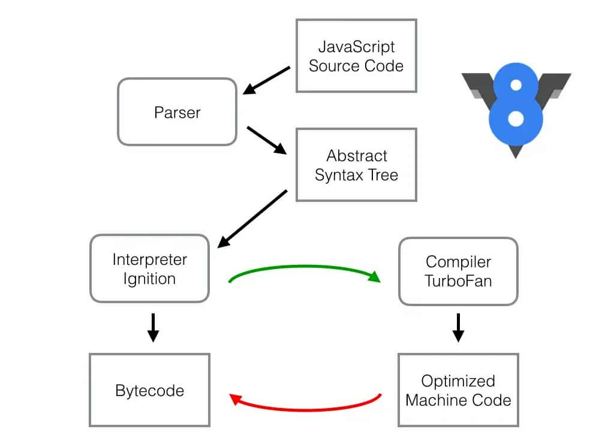
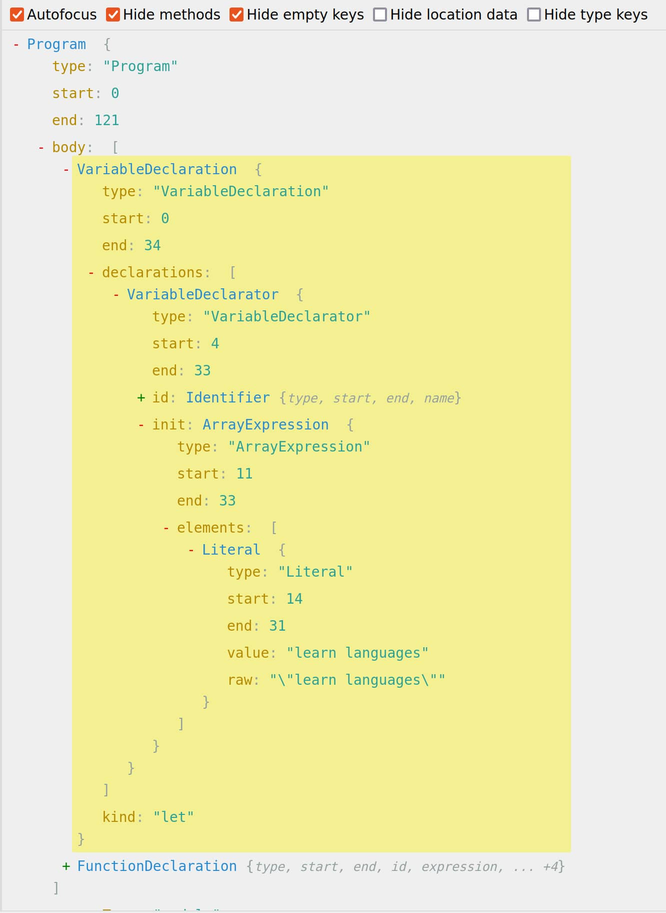
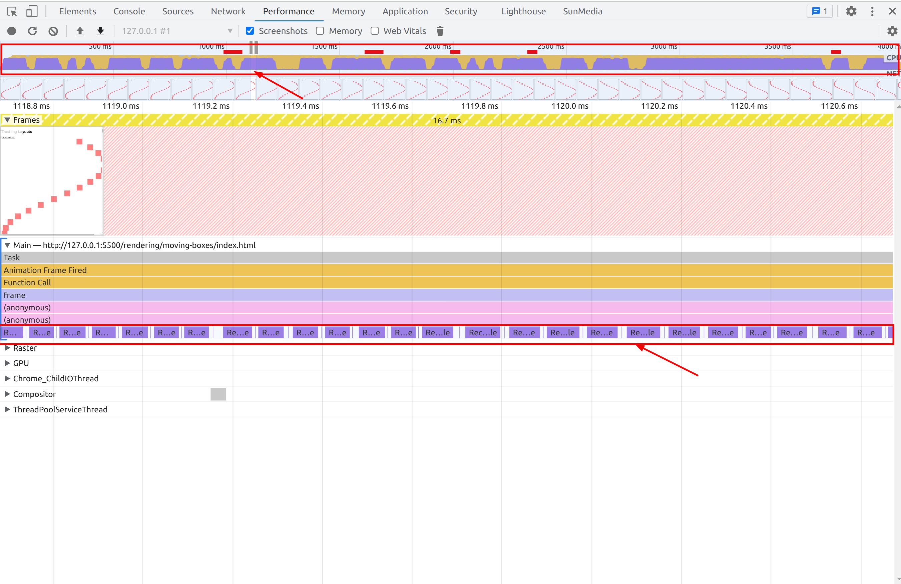
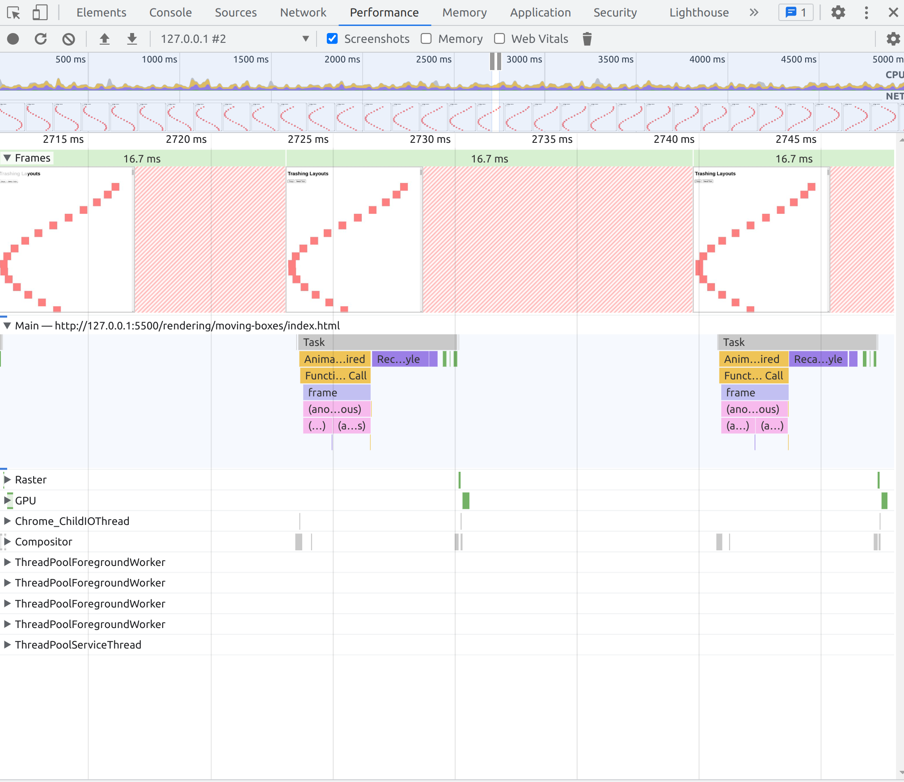
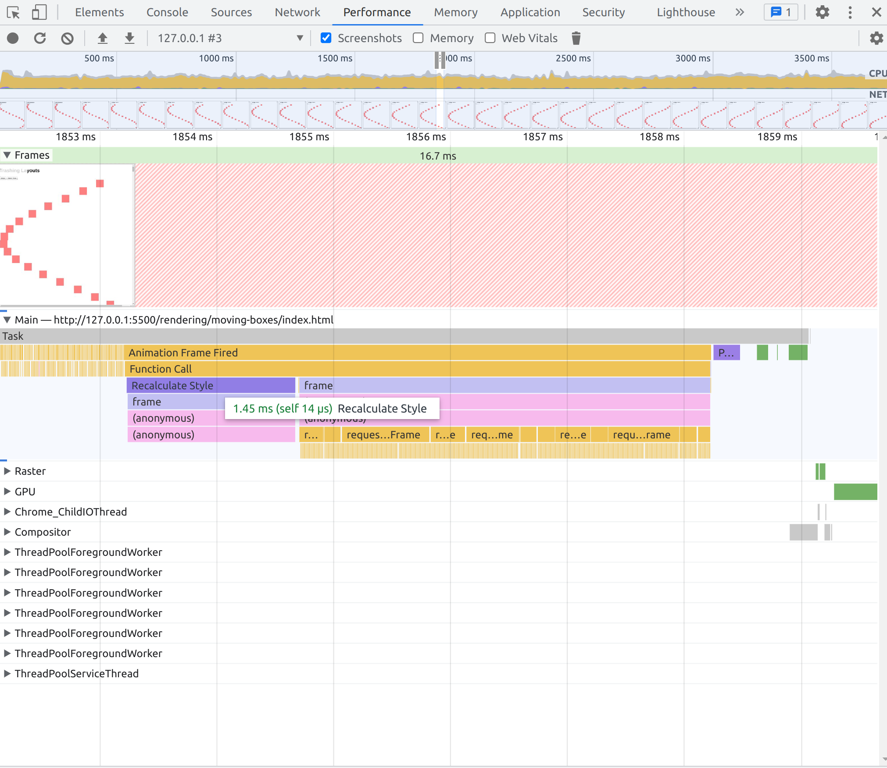

# JavaScript Performance

## Introducción

Los usuarios quieren que las aplicaciones web sean rápidas y que reaccionan de forma inmediata. Los usuarios esperan que las aplicaciones web se carguen en menos de 1
segundo, y que las animaciones se ejecuten en menos de 100 ms. Y si ya llegamos a los 10 segundos los usuarios abandonarán la aplicación web y buscarán una alternativa.

Hay muchas estadísticas que demuestran que las aplicaciones web lentas tienen un impacto negativo en la experiencia del usuario y en los ingresos de las empresas.

Esto se aplica a la mayoria de las plataformas, como curiosidad, la carga lenta se la permitimos a Gmail o plataformas que una vez dentro tenemos que estar bastante rato, y una vez cargadas son bastante rápidas.
Por el contrario, las webs como las de los periódicos tienen que ser extra rápidas, ya que cuando el usuario las consulta es para leer un par de titulares y salir.

### RAIL

RAIL es un modelo de referencia para medir la calidad de la experiencia del usuario en las aplicaciones web. RAIL es una abreviatura de las siguientes palabras: Response, Animation, Idle, Load.

#### Response

El usuario espera que la aplicación web responda de forma inmediata a sus acciones. En menos de 100 ms, la aplicación web debe responder a la interacción del usuario.

#### Animation

El usuario espera que las animaciones sean fluidas y suaves. En menos de 16 ms, la aplicación web debe ejecutar una animación.

#### Idle

El usuario espera que la aplicación web no se bloquee. La aplicación web debe ejecutar tareas de fondo y tareas de mantenimiento cuando el usuario no está interactuando con ella.

#### Load

El usuario espera que la aplicación web se cargue rápidamente. En menos de 1 segundo, la aplicación web debe mostrar el contenido principal.

### Percepción del usuario

"[Percepción del usuario de los retrasos en el rendimiento](https://web.dev/rail/)

**0 a 16 ms** Los usuarios son excepcionalmente buenos para rastrear el movimiento y no les gusta cuando las animaciones no son fluidas. Perciben que las animaciones son fluidas siempre que se rendericen 60 nuevos fotogramas por segundo. Eso es 16 ms por cada cuadro, incluido el tiempo que tarda el navegador en pintar el nuevo cuadro en la pantalla, dejando una aplicación de unos 10 ms para producir un cuadro.

**0 a 100 ms** Responde a las acciones del usuario dentro de esta ventana de tiempo y los usuarios sentirán que el resultado es inmediato. Un poco más y la conexión entre acción y reacción se rompe.

**100 hasta 1000 ms** Dentro de esta ventana, las cosas se sienten parte de una progresión natural y continua de tareas. Para la mayoría de los usuarios de la web, cargar páginas o cambiar de vista representa una tarea.

**1000 ms o más** Más allá de 1000 milisegundos (1 segundo), los usuarios pierden el enfoque en la tarea que están realizando.

**10000 ms o más** Más allá de los 10000 milisegundos (10 segundos), los usuarios se sienten frustrados y es probable que abandonen las tareas. Puede que vuelvan o no más tarde."

### Que optimizamos?

No tenemos que empezar a mejorar el performance de toda nuestra web como locos, intentando rascar ms. Lo que si que tenemos que hacer es tener en cuenta el performance en las partes que más importan al usuario.

Por ejemplo.

- Los diarios tienen que ser muy rápidos al mostrar los titulares.
- Twitter, Facebook... les interesa antes que nada mostrarte el primer tweet....

Así mismo, habra ciertas secciones de nuestra web, que no son tan importantes, por lo que podemos permitirnos que tarde un poco más en cargar.
Por ejemplo, podemos tener miles de peticiones a nuestra homepage, pero nadie va a vistiar los terminos y condiciones.

### Como medimos el performance?

No podemos analizar la performance siempre con el mismo dispositivo o con el último mobil/ordenador que ha salido al mercado.
Lo mismo con el internet, no podemos medir la performance con una conexión de 1 Gb/s, ya que no es lo que la mayoría de los usuarios tienen.

## JavaScript Performance

Podemos pagar para tener el servidor más rapido... pero si nuestra aplicación es client side, y el usuario tiene un móvil de hace 5 años, no vamos a poder hacer nada... No vamos a comprarle un móvil nuevo a cada usuario😅.

Cada vez enviamos más javascript al navegador, y cada vez es más complejo. Esto hace que el navegador tarde más en procesar el javascript. Asi como frameworks como React, que solo por el hecho de usarlo ya estas usando un montón de javascript.

Javascript es un lenguaje interpretado, pero en la práctica, los navegadores utilizan compiladores just-in-time (JIT) para convertir el código JavaScript en código máquina que pueda ejecutar la CPU. El JIT compilador analiza el código JavaScript y lo compila en código máquina en tiempo de ejecución. Esto sucede en la maquina del cliente, por lo que ellos estan pagando el coste y haciendo este trabajo por nosotros.

### Engine V8 de JavaScript

Cada navegador tiene su propio motor, por ejemplo Chrome tiene V8, Firefox tiene SpiderMonkey, Safari tiene Nitro, etc.

Si nos centramos en V8. El ciclo de javascript en V8 es el siguiente:

1. Subimos nuestro codigo a la nube.
2. El navegador descarga el codigo.
3. Parsing. Se convierte en un arbol de sintaxis abstracta (AST), que es una estructura de datos real que representa el código.
4. Interprete. El AST se compila en código máquina. Convierte el código JavaScript en bytes.
   4.1 Compilador de optimización, si detecta que hay codigo que se puede optimizar, lo pasa por aqui. Y lo devuelve como código máquina optimizado.
5. El código máquina se ejecuta en la CPU.



Recursos para profundizar sobre el tema:

- [soymichel](https://soymichel.medium.com/entendiendo-el-engine-v8-de-javascript-7e3d11443df8)
- [khattakdev](https://dev.to/khattakdev/chrome-v8-engine-working-1lgi)

#### Parsing

Convertimos el codigo en un AST, que es una estructura de datos real que representa el código. En si, es un árbol de objetos. Cada nodo del árbol representa una parte del código.

Ejemplo de un AST: [AST Explorer](https://astexplorer.net/)

```js
let tips = ["learn languages"];

function printTips() {
  tips.forEach((tip, i) => console.log(`Tip ${i}:` + tip));
}
```



Este parsing es muy costoso y es lento. Podemos llegar a 1mb/s en mobiles.

Una forma de reducir el tiempo de parseo... es tener menos código... hacer el análisis que necesitamos a primera instancia, y luego ir añadiendo cosas. Si se puede hacer más tarde, hazlo más tarde.

Entonces en el motor v8, hay dos maneras de hacer el parsing:

- Eager Parsing: Se hace en el momento que se descarga el código. Es muy costoso, pero es necesario para que el código se ejecute.

- Lazy Parsing: Se hace cuando se necesita. Es más barato, pero no se puede ejecutar hasta que se haya parseado.

Y nosotros **no tenemos control sobre esto**... es algo que elige chrome por nosotros.

En si podemos pensar que la mejor opción es Lazy Parsing... que lo hace gracias a la simplificación del código, es decir, si ve codigo que se va a ejecutar, lo parsea, pero si ve una clase, una llamada fetch... no lo parsea hasta que se necesite.

Ejemplo extraido de [stevekinney](https://speakerdeck.com/stevekinney/web-performance?slide=87)

```js
// This will be eagerly parsed
const a = 1;
const b = 2;

// This will be lazily parsed, because it's not needed to run the code
function add(a, b) {
  return a + b;
}

// Go back and parse add()
add(a, b);
```

Ahora bien caemos en un problema... que es mejor, parsear todo el código una vez, o estar analizando que es lo que se necesita, para después parsearlo?

#### Compilador de optimización

Este compilador en principio.

- Optimización especulativa
  - Usamos un interprete porque el optimizador del código es lento de empezar. El interprete es rápido, pero no sabe nada sobre nuestro código, por lo que no es tan rápido como lo es Turbofan.
  - No sabe que una función add, siempre va a recibir numeros, por lo que no puede optimizarla, por lo que el interprete se encarga de obtener feedback de como se esta usando la función.
- Clases ocultas para búsquedas dinámicas
- Incorporación de funciones

Javascript es díficil, dinámico y tiene muchas reglas, como por ejemplo, sumar strings es diferente a sumar numeros. Y el compilador de optimización en la mayoria de ocasiones no sabe que va a sumar, hasta que no se ejecuta esa parte del código.

El compilador de optimización, se encarga de analizar el código y ver que partes se pueden optimizar, y que partes no. Por ejemplo, si tenemos una función que siempre recibe numeros, intentara optimizarla.
Ahora bien, si detecta que la función no tiene un comportamiento predecible, no la optimizará. Por ejemplo, si el mismo argumento de una función recibe numeros, strings, undefinded, arrays...

#### Monomorfismo, Polimorfismo y Megamorfismo

Los argumentos no tienen porque ser siempre objetos

- Monomorfismo: Ejemplo: una función que recibe un objeto con la misma estructura, objeto con propiedad "x" con valor numérico.

**El interprete entiende que la función siempre va a recibir un objeto con la misma estructura, por lo que puede optimizarla y cachearla**.
En resumen, esto es todo lo que sé, he visto este tipo de objeto un millón de veces. Estoy listo, sé qué hacer, esto es lo mío

```js
fn({ x: 1 });
fn({ x: 2 });
fn({ x: 2 });
fn({ x: 1 });
```

- Polimorfismo: Ejemplo: una función que recibe un objeto con diferentes estructuras, pero siguen un patrón.

**Importante**, no pueden recibir más de 4 tipos diferentes de patrones v8 (megamorfismo)

**El interprete entiende que la función siempre va a recibir un objeto con poca variación en su composición, por lo que puede optimizarla y cachearla**
En resumen, he visto esto antes, dejame chequear a ver si lo puedo hacer más rápido.

```js
fn({ x: 1, a: 1 });
fn({ x: 2, b: 2 });
fn({ x: 2, c: 2 });
```

- Megamorfismo: Ejemplo, una función que recibe un objeto con diferentes estructuras. En el caso del motor v8 considera megamorfismo a funciones que reciben más de 4 tipos de patrones.

**El interprete entiende que la función siempre va a recibir un objeto con mucha variación en su composición, por lo que no puede optimizarla y cachearla**. Este estado existe para evitar estar cacheando de manera descontrolada los polimorfismos.
En resumen, no tengo idea de lo que va a pasar, no puedo optimizar esto.

```js
fn({ x: 1, a: 1 }); // Polimorfismo
fn({ x: 2, b: 2 }); // Polimorfismo
fn({ x: 2, c: 2 }); // Polimorfismo
fn({ x: 2, d: 2 }); // Megamorfismo
```

**El mono, poli y megamorfismo, no son solo para objetos**, en términos generales, cuanto más consistente es el material, más optimizaciones especulativas se pueden hacer, más rápido es el código.

Como los browsers saben que estas siguiendo un patrón... Utilizan funciones, clases ocultas...

Recursos para profundizar sobre el tema:

- [Slava Egorov](https://mrale.ph/blog/2015/01/11/whats-up-with-monomorphism.html)

### Optimización en node

Node nos permite encontrar código que no esta optimizado.

```bash
node --trace-opt index.js | grep myFunc
```

Recursos para profundizar sobre el tema:

- [Eugene Obrezkov](https://blog.ghaiklor.com/2016/05/16/tracing-de-optimizations-in-nodejs/)

## Rendering Performance

Con el HTML creamos el DOM.
Con el CSS creamos el CSSOM. Conjunto de reglas que se aplican a los elementos del DOM.
Con el DOM y el CSSOM creamos el Render Tree. Es el DOM con las reglas de CSSOM aplicadas.

Para hacer el render tree, se hace un recorrido del DOM, y se van aplicando las reglas de CSSOM. Si el elemento no tiene reglas de CSSOM, se aplica el estilo por defecto. En caso de tener un display: none, no se añade en el render tree.

Hay un proceso para saber que elementos se van a renderizar, y cuales no. Se llama layout. El layout es el proceso de calcular el tamaño y la posición de los elementos en la pantalla.

Paint, es el proceso de pintar los elementos en la pantalla.

Al momento de plantear las clases tienen que ser lo más simples posibles. Los selectores como más simples mejores.

Consejos para mejorar el CSS.

- BEM. Es una metodología para nombrar clases. Block, Element, Modifier.
- Reducir la cantidad de CSS que estamos enviando.
- Cuando menos css tengamos, menos css que tendremos que analizar.
- Reduce el número de estilos que afectan a un elemento.

Recursos para profundizar sobre el tema:

- [Jero medium](https://medium.com/weekly-webtips/understand-dom-cssom-render-tree-layout-and-painting-9f002f43d1aa)

### Javascript i la pipeline de render

Javascript tiene la capacidad de modificar el DOM (añadiendo o removiendo elementos), modificar una class, cambiar los estilos en linia... por lo que causa que se vuelva a iniciar el proceso de renderizanción.

### Layout y reflow

Reflows són muy caros en terminos de performance.

- Son operaciones bloqueantes. Todo se para..
- Consume CPU.

Los navegadores implementan diferentes medidas para mejorar la performance de los reflows.

Un reflow de un elemento, causa un reflow en todos los elementos, tanto de sus hijos como de sus padres.

Causas de un reflow, cualquier cambio de estilos, clase, modificar el DOM...

Seguido de un reflow, esta seguido de un repaint... Siempre que modificamos el layout, tenemos que repintar.

Como evitar reflows:

- No modificar las clases de un elemento. En caso de hacerlo modifica la class de un elemento hijo. Por ejemplo, no modificar el elemento `<body>`
- Evitar modificar los estilos inline, además si son repetitivos, mejor crear una clase.
- Si tenemos que modificar el DOM, mejor hacerlo en un solo bloque. Por ejemplo, si tenemos que añadir 10 elementos, mejor añadirlos todos a la vez, que uno a uno.
- [Debounce](https://css-tricks.com/debouncing-throttling-explained-examples/). Si tenemos que hacer un reflow, mejor hacerlo en un intervalo de tiempo.

#### Como probar el performance

Podemos usar la herramienta de performance de chrome, para ver cuando se esta haciendo un paint, o calculando el layout.

### Layout thrashing

Otra forma de nombrarlo es, "Forced Synchronous Layouts".

El layout thrashing es cuando el javascript esta leyendo y escribiendo en el DOM por lo que el browser está constantemente haciendo reflows y repintando.

Ejemplo de layout thrashing:


El browser se va deteniendo intentando calcular y pintar los elementos... y esto dentro de js, puede suceder por muchos motivos, por lo que tenemos que procurar seguir buenas prácticas.

Por ejemplo, **separar las consultas de escritura, y lectura**. Si tenemos que hacer un toggle de diferentes elementos y después obtener el tamaño, mejor hacerlo en un bloque. Primero hacer el toggle(escritura) y después obtener el tamaño(lectura).

El motivo es que en el cambio de escritura a lectura, va a parar tu js, para obtener la respuesta.

Mala practica.

```js
firstElement.classList.toggle("active"); // escritura
const firstElementWidth = firstElement.offsetWidth; // lectura
secondElement.classList.toggle("active"); // escritura
const secondElementWidth = secondElement.offsetWidth; // lectura
```

Buena practica.
Al estar agrupados, el navegador no tiene que cambiar entre modo escritura y lectura.

```js
firstElement.classList.toggle("active"); // escritura
secondElement.classList.toggle("active"); // escritura
const firstElementWidth = firstElement.offsetWidth; // lectura
const secondElementWidth = secondElement.offsetWidth; // lectura
```

#### Ejemplos con posibles mejoras

El código que se muestra a continuación se ha extraido de [stevekinney](https://github.com/stevekinney/web-performance/tree/master/rendering/moving-boxes)

En el caso por ejemplo de una animación esto va a tener un performance terrible, ya que estara todo el rato haciendo reflows.

```js
resgister((timestamp) => {
  elements.forEach((element) => {
    const top = element.offsetTop; // lectura
    const nextPosition = top + 1;
    element.style.transform = `translateY(${nextPosition}px)`; // escritura
  });
});
```


##### Mejora 1. Agrupamos las lecturas y escrituras.

```js
resgister((timestamp) => {
  const nextPositions = elements.map((element) => {
    const top = element.offsetTop; // lectura
    const nextPosition = top + 1;
    return nextPosition;
  });

  elements.forEach((element, index) => {
    const nextPosition = nextPositions[index];
    element.style.transform = `translateY(${nextPosition}px)`; // escritura
  });
});
```



##### Mejora 2. RequestAnimationFrame.

El requestAnimationFrame, es una función que se ejecuta en el siguiente ciclo de animación. Esto nos permite hacer que el browser sepa que estamos haciendo una animación, y no bloqueamos el hilo, pues aprovecharemos el siguiente repaint para hacer el cambio.

```js
resgister((timestamp) => {
  elements.forEach((element) => {
    const top = element.offsetTop;
    const nextPosition = top + 1;
    requestAnimationFrame(() => {
      element.style.transform = `translateY(${nextPosition}px)`;
    });
  });
});
```



##### Mejora 3. Fastdom

Fastdom es una [librería](https://github1s.com/wilsonpage/fastdom) que nos ayuda de gestionar el layout thrashing.
Cuadro de animación de solicitud para gobernarlos a todos, añaden todas las peticiones de lectura y escritura en una cola, y las ejecutan en el siguiente ciclo de animación. fastdom tiene algunos métodos, pero solo hay dos que te interesan, measure y mutate.

```js
registerNextClick((timestamp) => {
  elements.forEach((element) => {
    fastdom.measure(() => {
      const top = element.offsetTop;
      const nextPosition = Math.sin(top + 1);
      fastdom.mutate(() => {
        element.style.transform = `translateY(${nextPosition}px)`;
      });
    });
  });
});
```


### Frameworks and Layout Thrashing


No hace falta que usemos frameworks para obtener un buen performance. Pero si usamos frameworks, tenemos que tener en cuenta que ellos toman decisiones para nosotros, y que no siempre son las mejores.

#### React

React tiene un sistema de reconciliación, que es el que se encarga de comparar el DOM actual con el DOM que queremos pintar, y solo va a pintar los elementos que han cambiado.

Los resultados de react en modo desarollo van a ser peores que en modo producción.


## Load Performance

### Latencia y anchos de banda

Tenemos que tneer en cuenta que la latencia y el ancho de banda, son dos factores que afectan a la velocidad de carga de nuestra página. 

Muchas veces no pensamos en la latencia, pero es un factor muy importante, ya que si tenemos una latencia alta, el tiempo de carga de nuestra página va a ser muy alto.

Ancho de banda, es la cantidad de datos que podemos descargar en un segundo.

Latencia, es el tiempo que tarda en llegar un paquete de datos desde el servidor hasta el cliente.

TCP, transmissión control protocol, es un protocolo que se encarga de enviar los paquetes de datos, y de asegurarse de que lleguen todos. Se centra en la reliability.

TCP:
- Los paquetes se han enviado de forma ordenada.
- Los paquetes se han enviado de forma correcta, sin errores.
- El cliente conoce cada paquete.
- Las conexiones complicadas son manejadas de forma correcta.
- No sobre carga la red.

La tcp empieza enviando pequeños datos y empieza enviando más y más datos hasta que llega a un tamaño de paquete que la red puede manejar.

La ventana inicial tiene 14kb. Lo que significa que si puede obtener cualquier activo de menos de 14 kilobytes. Puedes enviarlo de una sola vez. Si son 28, entonces tenemos que empezar a hacer el peticiones. Y así sucesivamente.
Pero actualmente nuestras aplicaciones de JavaScript están creciendo...


(CloudPing)[http://www.cloudping.info/], es una herramienta que nos permite ver la latencia de nuestra página, desde diferentes partes del mundo.

Que lugar es el optimo para alojar nuestra página? En todos los sitios, alrededor del mundo. Por eso usamos CDN como Amazon o cloudflare. 

Una red de entrega de contenido (CDN) es un grupo de servidores distribuidos geográficamente que aceleran la entrega de contenido web acercándolo a donde están los usuarios.

Porque si tenemos un servidor en USA, y el usuario esta en España, la latencia va a ser muy alta.

### Caching

El caching es una técnica que nos permite almacenar datos en un lugar, para que cuando los necesitemos, no tengamos que volver a pedirlos.

1997, http añade Cache-Control, que nos permite controlar el caching, en el header de las peticiones.
El caching afecta solo a las peticiones seguras, http. GET, OPTIONS, HEAD.

No soporta peticiones POST, PUT, DELETE, PATCH.

Cache-controls headers:

- no-store
- no-cache
- max-age
- s-maxage
- immutable

Simplificamos las posibilidades.

**Cache missing** no hay una copia local.

**Stale**. Haz la petición. El navegador hace una copia pero si hay una versión más actualizada.

**Valid**. El navegador tiene una copia local, y no hace la petición.


[web.dev, HTTP Cache](https://web.dev/http-cache)
#### no-store

El navegador haze una petición cada vez. No guarda nada en cache.

#### no-cache

Puedes hacer una copia, pero en cada petición, tienes que volver a validar la copia.
Esto le indica al navegador que debe volver a validar con el servidor cada vez antes de usar una versión en caché de la URL.

#### max-age

Cuenta al navegador cuánto tiempo puede almacenar la copia local.

#### Como hacemos saber que tiene que volver ha hacer una petición?

Content-Addressable Storage

Es un nombre bonito para decir que es poner un identificador al archivo js, y que lo tiene que guardar en el cache por mucho tiempo. Cuando hacemos un cambio en el archivo, tenemos que cambiar el nombre del archivo, para que el navegador lo vuelva a descargar.

Podemos poner eso en nuestro archivo SMIL de estudio de índice y si actualizamos nuestra aplicación, actualizamos el archivo SMIL de estudio de índice, diríamos, está bien, aquí está la nueva versión. Así que, efectivamente, con eso obtenemos un cache-busting gratis. 

#### Caching en los CDN

No queremos usar esto para aferrarnos a todo para siempre porque si les enviamos una versión mala, estamos un poco perdidos. Pero, este **s-maxage** es solo para CDN porque si enviamos la CDN con una versión incorrecta, podríamos comunicarnos con esa CDN y decir, perder esa versión, borrarla de sus cachés.


