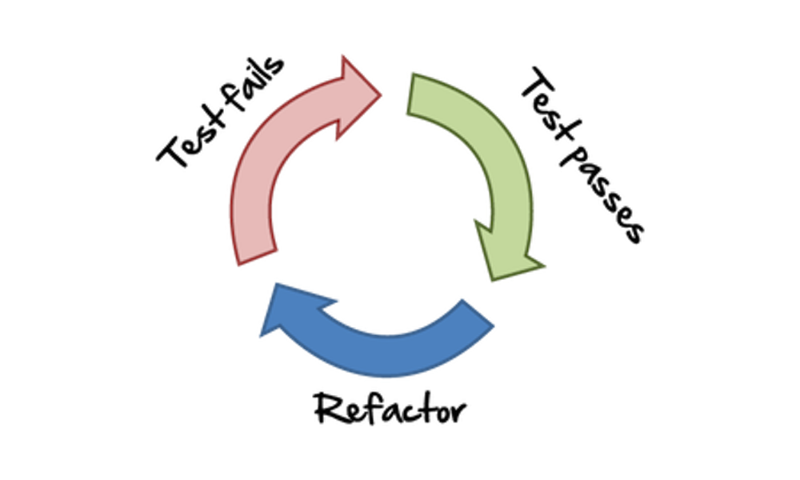

# TDD: Test-Driven Development

El TDD va más allá de los tests, **no es una técnica para hacer tests**, es una técnica para desarrollar software a partir de tests, lo dice el propio nombre, Test-Driven Development.

## Testing vs QA

El testing con QA no tiene nada que ver, están relacionados y hay tests entre medio, pero no es lo mismo.
EL TDD estaríamos haciendo tests antes de codificar y el QA vendría mucho más tarde, estaría validado que el código funciona, por lo que estaría en una fase posterior de la codificación.
A tener en cuenta que si tú haces TDD, la fase de QA va a ser mucho más sencilla.

## Ventajas

El TDD te fuerza a hacer los tests y acelera la codificación a largo plazo, pues te asegura una fase en la que vas a estar, iterando totalmente.
Refactors, con TDD puedes hacer todos los refactors que quieras.
Mejorar el code coverage.
Depurar mucho más rápido.
Documentación gratis. Los tests no solo te ayudan a validar que tu código funciona, sino que también te ayudan a documentar el código. Muchas veces entramos a los tests para ver qué parámetros les pasamos o que esperamos que devuelva...
Incrementan la calidad del código.

A tener en cuenta, que **si no se usa el TDD**, se pueden dar los siguientes casos:

- Tests que no te está dando feedback sobre tu código.
  - Puede ser que escribimos una función y tiene 50 líneas de código, y los tests no sabes a qué dan feedback o si se refieren a todo el código.
- Haces el test y de primeras te sale verde, ¿Cómo sabes que te está funcionado?
- A nivel personal, haces el código y puedes pensar que hacer los tests es una perdida de tiempo.
- Siempre vas a estar intentando testear el happy path, vas a testear el caso que te interesa.

## Ciclo TDD

El código normalmente lo desarrollamos con el siguiente orden: diseñarlo, programamos y luego hay gente que lo lleva a producción y otra gente que le añade tests, en el caso de que le añada tests vuelta a empezar, diseñarlo, codificar y programar.

Con TDD, el flujo cambia, primero diseñamos, luego hacemos los tests antes del código. No hacemos ninguna línea de código hasta que tengamos un test.



Primero haríamos un test en rojo. Luego hacemos la integración en código para pasarlo a verde. Y una vez en verde podemos hacer todos los refactors que necesitemos.

Rojo, pequeño test que no funciona. Estos tests como no tienen el código que están validando, van a fallar, ejemplo, queremos hacer una función de sumar, testeamos que no existe dicha función. La idea es añadir una funcionalidad que previamente no estaba en el sistema. - Si saliera verde desde el inicio, podría significar que el test no está bien hecho o que estamos intentando implementar una funcionalidad ya existente.

Verde, pequeño test que funciona. Conseguir los tests que estaban en rojo, que pasen a verde. **¡Con el mínimo código posible!** De esta forma evitamos introducir comportamientos adicionales. Y centrarnos en una cosa a la vez, centrarnos en un método, es típico empezar con problemas básicos.

Refactor, renombrar variables, eliminar duplicaciones...

En resumen, primero hacemos el test, luego hacemos que funcione sin importar como escribimos el código y el paso final es refactorizarlo y utilizar las mejores prácticas. **Y volvemos a empezar**. Hasta alcanzar la solución.

## Leyes TDD

1. No puedes escribir código si no hay un test que falle.

2. No puedes escribir más código de lo necesario para que el test pase.
   Error común, no se trata de escribir todos los tests desde el inicio y que todos fallen de golpe.
   No tienes que escribir más tests de los necesarios para que falle, si escribes un test falla ya está, ese test lo que vas a hacer es implementar el código y vuelves otra vez a los tests, y así todo el rato. No es que haces 15-20 tests al principio y luego los vas implementando.

3. No puedes escribir código que no sea necesario para que el test pase.
   A veces te encuentras que entiendes la lógica y avanzas. ¡Puedes estar tentado, no te adelantes! No escribas código que no sea necesario para que el test pase.

## ¿El TDD hace el desarrollo más lento?

Al principio cuando estás empezando a desarrollar, obviamente puede ser que vas más lento, vas más seguro pero más lento.

Usualmente, pensamos que el desarrollo es una línea recta, que va de A a B, y es obvio que el TDD cuando empiezas en el punto A, es un poco más lento que si lo hicieras de otra forma, pero hay que tener en cuenta que el desarrollo nunca termina, seguimos trabajando en empresas y ese código va a quedarse ahí para siempre y lo que te cuesta un poquito al principio te sirve tanto como para mantener como añadir nuevas features y eso te lo acelera.

## Ejemplo función suma

##### Paso 1 ❌

El primer test, validamos que sea una función.
Dado que no hemos creado la función, el test va a fallar.

```js
it("should be a function", () => {
  expect(typeof sum).toBe("function");
});
```

Siempre tenemos que estar en rojo antes que en verde. Si hacemos los tests finales, no estamos haciendo TDD.

##### Paso 2 ✅

Creamos la función sum, y hacemos que el test pase.

```js{1}
function sum() {}

it("should be a function", () => {
  expect(typeof sum).toBe("function");
});
```

##### Paso 3 ❌

Un test para validar que de error si no estamos pasando parámetros, no debemos borrar los tests anteriores, sino que añadir nuevos.

```js{4-6}
function sum() {}

// ... the previous test
it("should throw an error if 2 number params are not provided", () => {
  expect(() => sum()).toThrow();
});
```

##### Paso 4 ✅

```js{2-4}
function sum(a, b) {
  if (typeof a !== "number" || typeof b !== "number") {
    throw new Error(); // No hace falta que añadamos un mensaje, con esto ya pasamos el test. Porque si no ya estaria haciendo codigo de más
  }
}

// ... the previous test
it("should throw an error if 2 number params are not provided", () => {
  expect(() => sum()).toThrow();
});
```

##### Paso 5 ❌

```js{8-10}
function sum(a, b) {
  if (typeof a !== "number" || typeof b !== "number") {
    throw new Error();
  }
}

// ... the previous test
it("should throw an especific error messsage if 2 number params are not provided", () => {
  expect(() => sum()).toThrow("2 numbers are required");
});
```

##### Paso 6 ✅

```js{3}
function sum(a, b) {
  if (typeof a !== "number" || typeof b !== "number") {
    throw new Error("2 numbers are required");
  }
}

// ... the previous test
it("should throw an especific error messsage if 2 number params are not provided", () => {
  expect(() => sum()).toThrow("2 numbers are required");
});
```

##### Paso 7 ❌

El typeof de NaN es number, por lo que tenemos que añadir un test para validar que no sea NaN.

```js{8-10}
function sum(a, b) {
  if (typeof a !== "number" || typeof b !== "number") {
    throw new Error("2 numbers are required");
  }
}

// ... the previous test
it("should throw a specific error message if some of the arguments isNan", () => {
  expect(() => sum(NaN, NaN)).toThrow("isNan is not a valid number");
});
```

##### Paso 8 ✅

```js{5-7}
function sum(a, b) {
  if (typeof a !== "number" || typeof b !== "number") {
    throw new Error("2 numbers are required");
  }
  if (Number.isNaN(a) || Number.isNaN(b)) {
    throw new Error("isNan is not a valid number");
  }
}

// ... the previous test
it("should throw a specific error message if some of the arguments isNan", () => {
  expect(() => sum(NaN, NaN)).toThrow("isNan is not a valid number");
});
```

##### Paso 9 ❌

```js{11-13}
function sum(a, b) {
  if (typeof a !== "number" || typeof b !== "number") {
    throw new Error("2 numbers are required");
  }
  if (Number.isNaN(a) || Number.isNaN(b)) {
    throw new Error("isNan is not a valid number");
  }
}

// ... the previous test
it("should return the sum of 2 numbers", () => {
  expect(sum(1, 2)).toBe(3);
});
```

##### Paso 10 ✅

```js{8}
function sum(a, b) {
  if (typeof a !== "number" || typeof b !== "number") {
    throw new Error("2 numbers are required");
  }
  if (Number.isNaN(a) || Number.isNaN(b)) {
    throw new Error("isNan is not a valid number");
  }
  return 3; // Hacemos el minimo para que de verde
}

// ... the previous test
it("should return the sum of 2 numbers returns 3", () => {
  expect(sum(1, 2)).toBe(3);
});
```

##### Paso 11 ❌

```js{12-14}
function sum(a, b) {
  if (typeof a !== "number" || typeof b !== "number") {
    throw new Error("2 numbers are required");
  }
  if (Number.isNaN(a) || Number.isNaN(b)) {
    throw new Error("isNan is not a valid number");
  }
  return 3;
}

// ... the previous test
it("should return the sum of 2 numbers", () => {
  expect(sum(1, 3)).toBe(4);
  expect(sum(1, 4)).toBe(5);
});
```

##### Paso 12 ✅

```js{8}
function sum(a, b) {
  if (typeof a !== "number" || typeof b !== "number") {
    throw new Error("2 numbers are required");
  }
  if (Number.isNaN(a) || Number.isNaN(b)) {
    throw new Error("isNan is not a valid number");
  }
  return a + b; // Ahora que el test, nos ha dado un patrón, podemos modificar la función.
}

// ... the previous test
it("should return the sum of 2 numbers", () => {
  expect(sum(1, 3)).toBe(4);
  expect(sum(1, 4)).toBe(5);
});
```

#### Refactor

Ahora tocaría refactorizar el código, podemos estar tranquilos en los refactors, porque está testeado. Con el refactor el código debe ser más legible. Una forma simple, en el caso de la suma, sería exportar la función a un archivo, y luego importarla en el test.

### A tener en cuenta

Por muy sencillo que era el caso, los tests nos han estando guiando para que no nos olvidemos de nada, y vayamos hacia la solución.

**Los tests se puden borrar**, los casos redundantes los podemos borrar/editar. Ejemplo el test que testea que la función es una función. O que el resultado sea 3 se puede añadir en el test "should return the sum of 2 numbers"
