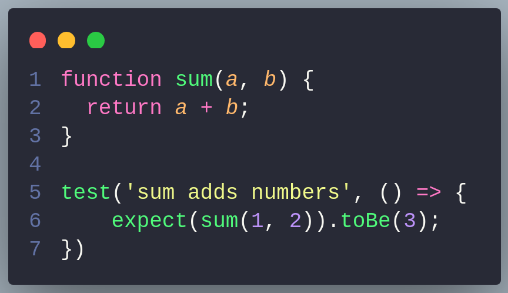
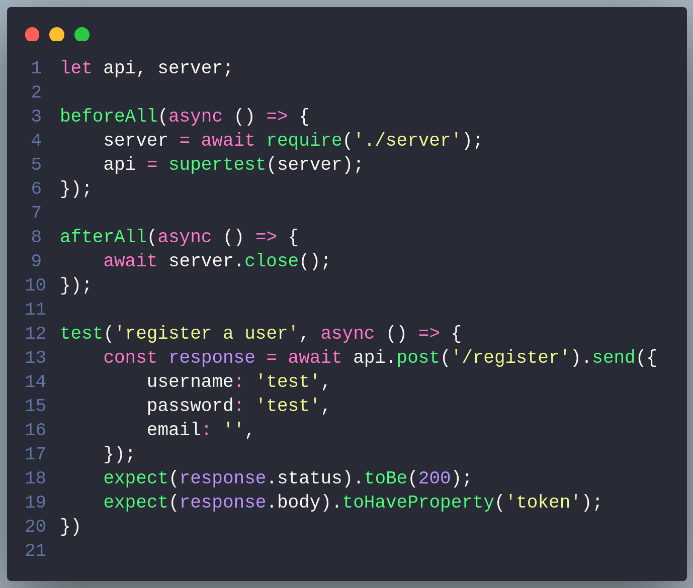
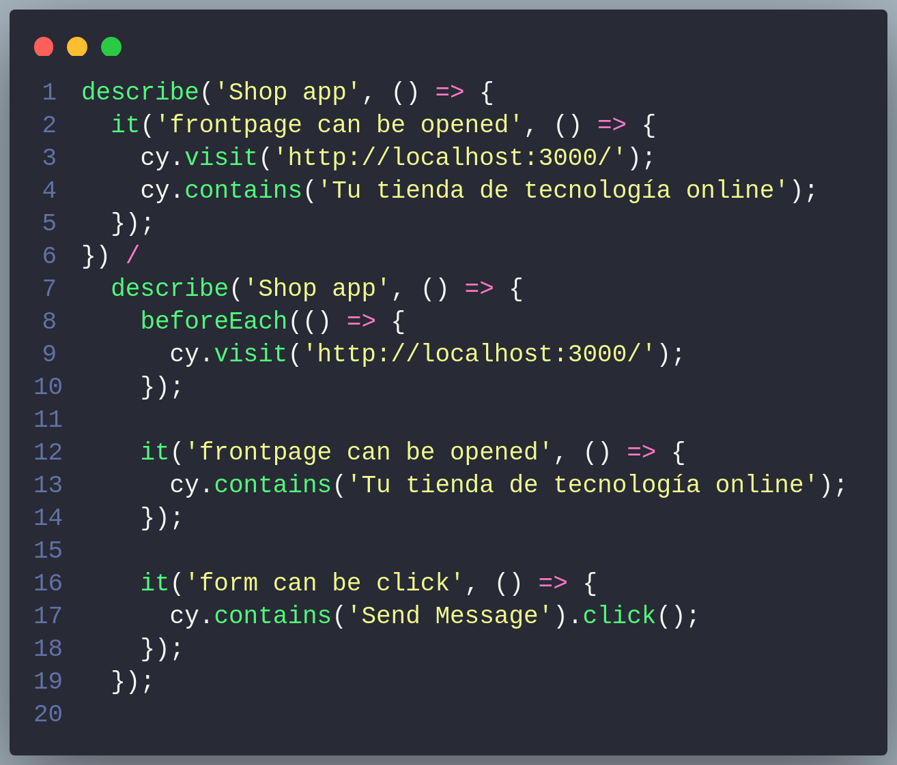

# Vue Unit Testing

Estos apuntes están basados en el curso de [Unit Testing en Vue.js 3](https://platzi.com/cursos/vue-unit-testing/) - Maria Camila Lenis

## Introducción

Dentro del testing de Vue, hay dos tipos de pruebas:

- **Pruebas funcionales**: validan las funcionalidades de nuestra aplicación.

  - Unitarias: Verifican una sola cosa. Como una funcion aislada para verificar que hace lo que nos esperamos. Algo en concreto, un método…

    

    - Integración: Se encargan de simular la integración, es decir, que varios componentes funcionen juntos. Por ejemplo, que un componente padre pase datos a un componente hijo, o en el caso de un backend, que se haga una petición a un endpoint y se reciba la respuesta esperada.

    

    - E2E: Son pruebas que simulan el comportamiento de un usuario. Por ejemplo, que un usuario haga click en un botón y se muestre un modal.

    

- **Pruebas no funcionales**: Son todo lo que está fuera de nuestro alcance, como el performance y otros atributos de calidad.
  - Estres: Ejemplo, que nuestra aplicación soporte un número elevado de peticiones.

## Primer test

Vamos a crear un test unitario para el componente `HelloWorld.vue` que viene por defecto en el proyecto de Vue.
Para eso vamos a utilizar la libreria [`vue-test-utils`](https://v1.test-utils.vuejs.org/) que nos permite crear un wrapper de nuestro componente y así poder hacer las pruebas.

```js
// HelloWorld.spec.js
import { mount } from "@vue/test-utils";

const MessageComponent = {
  template: "<p>{{ msg }}</p>",
  props: ["msg"],
};

test("renders props.msg when passed", () => {
  const wrapper = mount(MessageComponent, {
    propsData: {
      msg: "Hello world",
    },
  });

  expect(wrapper.text()).toContain("Hello world");
});
```

wrapper es un objeto que nos permite acceder a las propiedades y métodos de nuestro componente. En este caso, estamos accediendo al texto que se muestra en el componente y comprobando que coincida con el mensaje que le hemos pasado.

## Testear componentes sin dependencias

Un ejemplo de test básico de un componente sin dependencias en el que evaluamos que se renderice correctamente:

```js
// HelloWorld.spec.js
import { shallowMount } from "@vue/test-utils";
import HelloWorld from "@/components/HelloWorld.vue";

describe("HelloWorld.vue", () => {
  test("render the component", () => {
    const wrapper = shallowMount(HelloWorld);

    const component = wrapper.find(".hello");

    expect(component.classes()).toContain("hello");
  });
});
```

## Testear componentes con dependencias

En muchos casos nuestros componentes tienen dependencias. Por ejemplo, una store en vuex, un router, un servicio, etc. En estos casos, tenemos que mockear las dependencias para poder testear el componente.

```js
createApp(App).use(router).use(store).mount("#app");
```

```js
import { createStore } from "vuex";

test("mounting a component with store", () => {
  const store = createStore({
    state: {
      count: 0,
    },
  });

  const wrapper = shallowMount(HelloWorld, {
    global: {
      plugins: [store],
    },
  });

  const component = wrapper.find("#counter");

  expect(component.text()).toEqual("0");
});
```

## Shallow vs Mount

- **Shallow**: Renderiza el componente sin renderizar sus hijos. Es decir, si tenemos un componente padre que tiene un componente hijo, con shallow solo renderizamos el componente padre, no el hijo. Esta enfocado a test unitario y el tiempo de ejecución es más rápido.

- **Mount**: Renderiza el componente y sus hijos. Enfocado a test de integración y el tiempo de ejecución es más lento, por lo que impacta en la performance.

## Wrapper

El wrapper es un objeto que nos permite acceder a las propiedades y métodos de nuestro componente. [Link a la documentación](https://test-utils.vuejs.org/api/#wrapper-methods).

Un ejemplo muy simple de un contador.

```js
// Counter.spec.js
import { shallowMount } from "@vue/test-utils";
import Counter from "@/components/Counter.vue";

describe("Counter.vue", () => {
  test("increment the counter", () => {
    const wrapper = shallowMount(Counter);

    const button = wrapper.find("button");

    expect(wrapper.vm.count).toEqual(0);
    wrapper.vm.increment();
    expect(wrapper.vm.count).toEqual(1);
  });
});
```

## Eventos

Para testear eventos, podemos utilizar el método `trigger` del wrapper.

```js
// Counter.spec.js
import { shallowMount } from '@vue/test-utils';
import Counter from '@/components/Counter.vue';

describe('Counter.vue', async () => {
  test('increment the counter', () => {
    const wrapper = shallowMount(Counter);

    const button = wrapper.find('button');

    expect(wrapper.vm.count).toEqual(0);
    await button.trigger('click');
    expect(wrapper.vm.count).toEqual(1);
  });
});
```

## Mocks

Los mocks sirven para simular dependencias. Por ejemplo, si tenemos un componente que hace una petición a un endpoint, podemos mockear el servicio para que no haga la petición y así poder testear el componente.

Podemos mockear componentes, directivas, filtros, etc. para poder testear nuestros componentes.

### SpyOn

```js
// Counter.spec.js
import { shallowMount } from "@vue/test-utils";
import Counter from "@/components/Counter.vue";

test("increment the counter", async () => {
  const spy = jest.spyOn(Counter.methods, "increment");

  const wrapper = shallowMount(Counter);

  const button = wrapper.find("button");

  expect(wrapper.vm.count).toEqual(0);
  await button.trigger("click");
  expect(wrapper.vm.count).toEqual(1);
  expect(spy).toHaveBeenCalled();
});
```

### jest.fn()

En el caso que queramos mockear un método de un componente, podemos utilizar `jest.fn()`. Esto nos permite comprobar que el método ha sido llamado y con qué parámetros. También podemos mockear el método para que devuelva un valor. En este caso, no se ejecutará el método original.

```js
// Counter.spec.js
import { shallowMount } from "@vue/test-utils";
import Counter from "@/components/Counter.vue";

test("increment the counter", async () => {
  const initialCounter = 10;
  const mockIncrement = jest.fn();

  const wrapper = shallowMount(Counter, {
    data() {
      return {
        counter: initialCounter,
      };
    },
    methods: {
      increment: mockIncrement,
    },
  });

  const button = wrapper.find("button");

  expect(wrapper.vm.counter).toEqual(initialCounter);
  await button.trigger("click");
  expect(wrapper.vm.counter).toEqual(initialCounter);
  expect(mockIncrement).toHaveBeenCalled();
});
```

## Múltiples componentes

En el caso que queramos testear un componente que tiene varios componentes hijos, podemos utilizar el método `findComponent` para encontrar el componente hijo.

```js
// Counter.spec.js
import { shallowMount } from "@vue/test-utils";
import Counter from "@/components/Counter.vue";

describe("Counter.vue", () => {
  test("increment the counter", async () => {
    const wrapper = shallowMount(Counter);

    const button = wrapper.find("button");
    const counter = wrapper.findComponent({ name: "Counter" });

    expect(counter.vm.count).toEqual(0);
    await wrapper.vm.increment();
    expect(counter.vm.count).toEqual(1);
  });
});
```

## Testing UI

Para testear la UI, podemos utilizar `attributes` y `classes` del wrapper.

```js
// Counter.spec.js

import { shallowMount } from "@vue/test-utils";
import Counter from "@/components/Counter.vue";

describe("Counter.vue", () => {
  test("the button must not be disabled", async () => {
    const wrapper = shallowMount(Counter);

    const button = wrapper.find("button");

    expect(button.attributes("disabled")).toBeUndefined();
    expect(button.classes()).not.toContain("disabled");
  });
});
```
